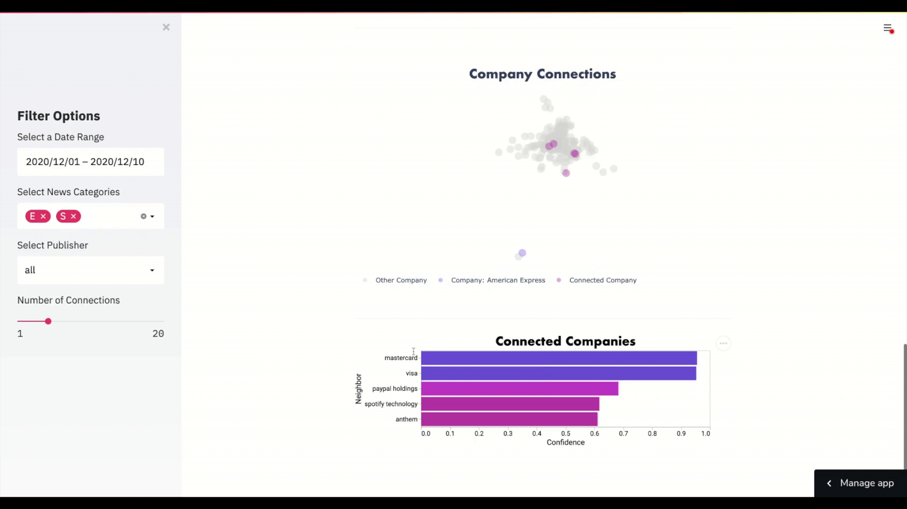
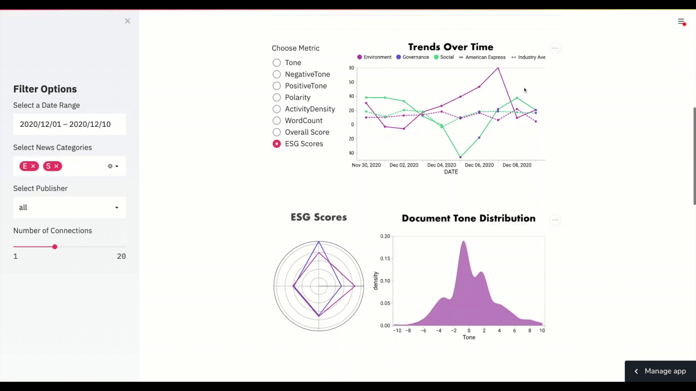

# ESG AI  
***Finastra [Hack to the Future 2020](https://devpost.com/software/esg-ai) Winner: Best Environmental Impact & Best User Experience***
<br></br>
**Demonstrating the power of Streamlit.** [](https://share.streamlit.io/hannahawalsh/esg_ai/main/app.py)  
<br></br>


## Background
---
Environmental, Social, & Governance ([ESG](https://en.wikipedia.org/wiki/Environmental,_social_and_corporate_governance)) investing has rapidly gained popularity in the world of finance. The idea is to invest in companies that are sustainable, particularly in in the 3 ESG categories:  
  - ***E*****nvironmental** - Issues such as climate change and pollution
  - ***S*****ocial** - Issues around workplace practices and human capital
  - ***G*****overnance** - Issues such as executive pay, accounting, and ethics  

There has been a tremendous amount of research around ESG investing. Harvard Law School Forum on Corporate Governance published a paper titled "ESG Matters" in which they studied companies with particularly high ESG scores compared to those with low scores with the following conclusions:
  1. Higher ESG is associated with higher profitability and lower volatility</li>
  2. High ESG scoring companies tend to be good allocators of capital</li>
  3. Good ESG companies generally have higher valuations, EVA growth, size, and returns</li>


<br></br>
### ESG Reporting
---
Currently 90% of S&P 500 companies publish annual sustainability reports, which can range from as little as 30 pages to over 200 pages. There is not one clear reporting format, but there are some general reporting guidelines. For example, [Nasdaq](https://www.nasdaq.com/ESG-Guide) publishes their own guide to help companies report meaningful information to stakeholders. Analysts leverage these reports to understand company trends and themes. Developing an investment thesis is a painstaking, manual process that can take weeks for a single company.

<br></br>
### Greenwashing
---
*Greenwashing* is the practice of making statements or policies that make an investment appear more serious about ESG than it actually is. As such, analysts need to be mindful of self-reporting and make sure to leverage other credible sources in order to minimize the effect of greenwashing on our sustainability analysis.

<br></br>
### Current Approach
---
ESG scoring is tricky. Research analysts leverage many sources to manually come up with scores around the ESG categories. These scores must be updated every so often, but by the nature of the current process scores cannot be reported in real time. As there are thousands of companies, the current approach is hardly scalable.

<br></br>
### Our Approach
---  
We aim to make ESG scoring an automatic, data-driven process. We leverage the [GDelt](https://www.gdeltproject.org/) news source to ingest historical and real-time news articles, tweets, and other digital publications that we classify into the three ESG categories. 
<br></br>

<br></br>

<br></br>
We then perform scoring based on sentiment, which can be adjusted based on given windows of time. Additionally, we leverage the deep learning algorithm, **Node2Vec** to embed the connections on a graph from news article mentions. This allows us to find better suggested competitors, allowing us to compare ESG results across companies. 
<br></br>
  

<br></br>
### Examples  of ESG found in News
---
#### E: Nike (NKE):
“Its Flyknit and Flyleather products were developed with environmental sustainability in mind. Nike signed onto a coalition of companies called RE100, vowing to source 100% renewable energy across its operations by 2025. There's more, but any interested investors should read Nike's latest sustainability report, which uses the GRI framework, the Sustainability Accounting Standards Board (SASB), and the United Nations' Sustainable Development Goals (SDG).”  

#### S: Accenture (ACN):
“Accenture pays close attention to its diversity and inclusion in its workforce. The company plans to improve its workplace gender ratios, with a goal to have 50% female and 50% male employees by the end of 2025. Accenture plans to better its corporate makeup as well, pledging to have at least 25% female managing directors by 2020.”  

#### G: Intuit (INTU):
“It has achieved a 40% diverse board, one of the highest levels in corporate America today. Intuit shows accountability by tying its executives' incentive compensation to revenue and non-GAAP (Generally Accepted Accounting Principles) operating income, as well as to the company's overall performance on annual goals related to employees, customers, partners, and stockholders.”   
[source](https://www.fool.com/investing/stock-market/types-of-stocks/esg-investing/)

<br></br>
## App Installation
---
We have packaged our application as a streamlit app. A majority of the codebase is runs in Databricks, leveraging the power of Spark - an architecture diagram can be found in our slides. However, by providing the generated files, we have created an application that can be run locally. To get started, clone the repository into a directory of your choice and ensure your python environment has the following dependencies:
  - Streamlit (version 0.70.0 or later)
  - Pandas (version 1.0.0 or later)
  - Numpy
  - Altair
  - NetworkX
  - Plotly
  - Colour  

You can easily install all of these by navigating to the cloned directory and running:  

On MacOs or Linux:  

```bash 
python -m pip install -r requirements.txt 
```
On Windows:
```bash 
py -m pip install -r requirements.txt
```
<br></br>
Once you have navigated to the cloned directory, run the following command:
```bash
streamlit run app.py
```
You should be navigated to a localhost link where you will see the application running.



Thanks to Streamlit Sharing, we have also been able to host the app for free! You can find that [**HERE**](https://share.streamlit.io/hannahawalsh/esg_ai/main/app.py)!

<br></br>
## Note
We originally built our code in [this other repo](https://github.com/adamFinastra/ESGAI), but due to Streamlit Sharing being in beta mode, it was forced to be moved to this Github account, which has permissions.


## License
[MIT](https://choosealicense.com/licenses/mit/)
